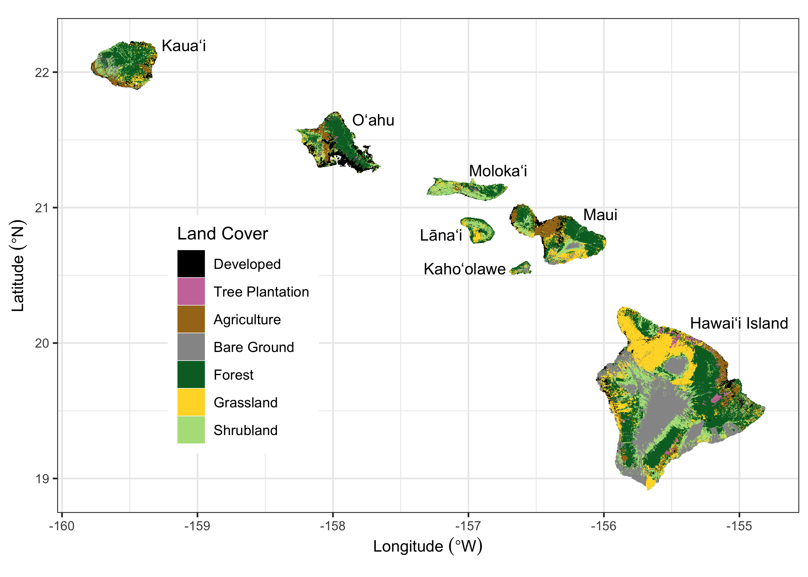
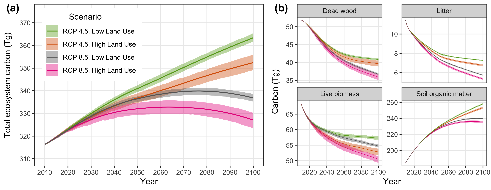
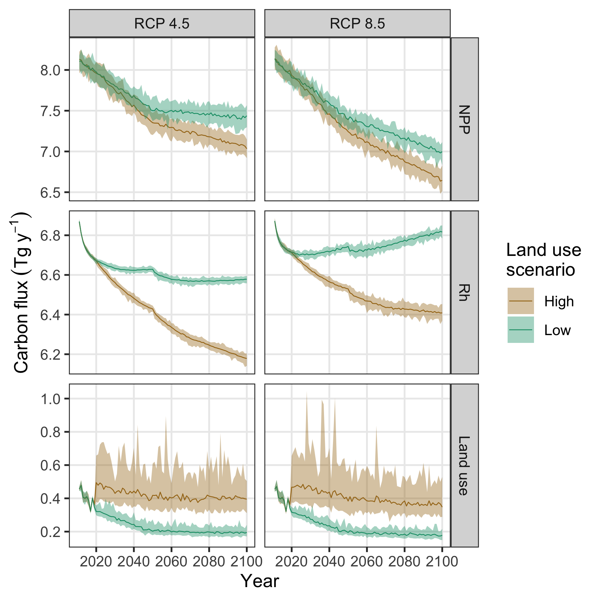
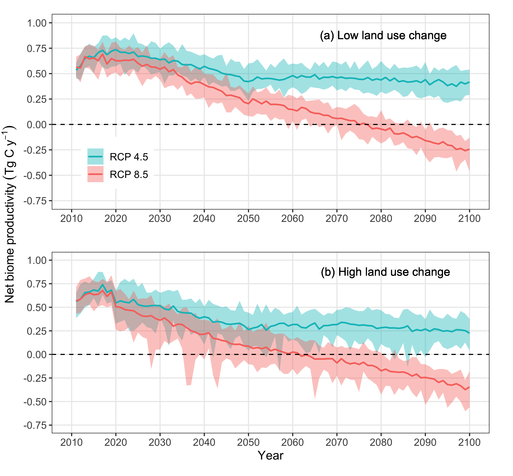
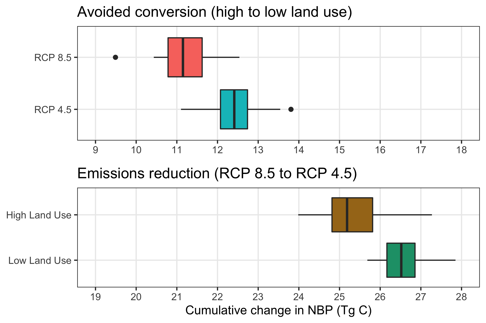
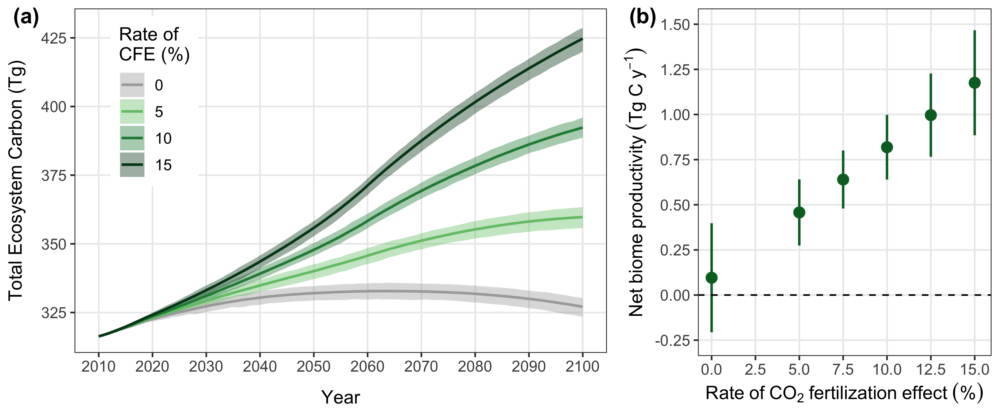

```{r setup, include=FALSE}
options(tinytex.verbose = TRUE)
knitr::opts_chunk$set(echo = FALSE)
```
Paul C. Selmants^1,6^, Benjamin M. Sleeter^2^,  Jinxun Liu^1^, Tamara S. Wilson^1^,  
Clay Trauernicht^3^, Abby G. Frazier^4^, Gregory P. Asner^5^  

**Affiliations:**  
^1^U.S. Geological Survey, Moffett Field, CA, USA   
^2^U.S. Geological Survey, Seattle, WA, USA  
^3^University of Hawai`i at Mānoa, Honolulu, HI, USA  
^4^The East-West Center, Honolulu, HI, USA  
^5^Arizona State University, Tempe, AZ, USA  
^6^Author to whom correspondence should be addressed  
  

**Email:** pselmants@usgs.gov  

**Running title:** Hawaii carbon balance  
**Keywords:** land use, climate change, carbon balance, Hawaii, scenarios, disturbance, ecosystem model  
  
  
**Date:** `r format(Sys.time(), '%B %d, %Y')`  
   


\pagebreak

## Abstract
The State of Hawai`i passed legislation to be carbon neutral by 2045, a goal that will partly depend on carbon sequestration by terrestrial ecosystems. However, there is considerable uncertainty surrounding the future direction and magnitude of the land carbon sink in the Hawaiian Islands. We used simulation modeling to assess how projected future changes in climate and land use will influence ecosystem carbon balance in the Hawaiian Islands under all combinations of two radiative forcing scenarios (RCPs 4.5 and 8.5) and two land-use scenarios (low and high) over a 90-year timespan from 2010-2100. Collectively, terrestrial ecosystems of the Hawaiian Islands acted as a net carbon sink under low radiative forcing (RCP 4.5) for the entire 90-year simulation period, with low land-use change further enhancing carbon sink strength. In contrast, Hawaiian terrestrial ecosystems transitioned from a net sink to a net source of CO~2~ to the atmosphere under high radiative forcing (RCP 8.5), with high land-use accelerating this transition and exacerbating net carbon loss. A sensitivity test of the CO~2~ fertilization effect on plant productivity revealed it to be a major source of uncertainty in projections of ecosystem carbon balance. Reconciling this uncertainty in how net photosynthesis will respond to rising atmospheric CO~2~ will be essential to realistically constrain simulation models used to evaluate the effectiveness of ecosystem‐based climate mitigation strategies.   

## Introduction
Terrestrial ecosystems are a major sink for atmospheric carbon dioxide (CO~2~), removing ~30% of human emissions on an annual basis and reducing the rate of increase in atmospheric CO~2~ [@keenan_terrestrial_2018]. Interannual fluctuations in carbon uptake by land ecosystems is the primary driver of year-to-year variation in atmosphereric CO~2~ growth rate @friedlingstein_global_2019]. There is increasing recognition among policymakers that natural and angricultural ecosystems can contribute to climate mitigation, which has given rise to the popularity of “natural carbon solutions” [@cameron_ecosystem_2017]. Natural climate solutions, defined as conservation and land management efforts aimed at enhancing ecosystem carbon storage [@griscom_natural_2017], are appealing because they are seen as cost-effective and readily available [@averchenkova_climate_2017; @cameron_ecosystem_2017; @fargione_natural_2018]. A growing number of sub-national jurisdictions plan to incorporate natural climate solutions as part of a suite of emissions reduction efforts to achieve carbon neutrality by mid-century. However, uncertainty surrounding the future direction and magnitude of the land carbon sink, especially at the regional scale, complicates efforts to effectively implement ecosystem-based carbon climate mitigation strategies.   


Interannual variability in climate, land use, and land cover change [@ahlstrom_dominant_2015; @prestele_current_2017].  

Hawaii was the first U.S. state to enact legislation supporting commitments and goals of the Paris climate agreement. Specifically, Hawaii passed Act 

The main Hawaiian Islands are a complex mosaic of natural and human-dominated landscapes overlain by steep climate gradients across relatively short distances.   

## Methods
We used the Land Use and Carbon Scenario Simulator (LUCAS), an integrated landscape change and carbon gain-loss model, to project changes in ecosystem carbon balance for the seven main Hawaiian Islands under all combinations of two land-use scenarios (low and high) and two radiative forcing scenarios (RCP 4.5 and RCP 8.5). We also developed a separate set of scenarios to test model sensitivity to different levels of a CO~2~ fertilization effect (CFE). The landscape change portion of LUCAS is a state-and-transition model that applies a Monte Carlo approach to track the state type and age of each simulation cell in response to a pre-determined set of transitions [@daniel_state-and-transition_2016]. The carbon gain-loss portion tracks carbon stocks within each simulation cell over time as continuous state variables, along with a pre-defined set of continuous flows specifying rates of change in stock levels over time [@daniel_integrating_2018; @sleeter_effects_2019]. We parameterized the Hawai`i LUCAS model to estimate annual changes in carbon stocks and fluxes in response to land use, land use change, wildland fire, and long-term climate variability for the time period 2010-2100. 

### *Study area*
The spatial extent of this study was the terrestrial portion of the seven main Hawaiian Islands (figure 1), a total land area of 16,554 km^2^. We subdivided this landscape into a grid of 264,870 simulation cells, each of which was 250 x 250 m in size. Each simulation cell was assigned to one of 210 possible state types based on the unique combination of three moisture zones (dry, mesic, and wet; figure S1), seven islands, and ten discrete land cover classes (figure 1). 

```{r fig.align = 'center', out.width = "99%", fig.cap = "Land cover classification of the seven main Hawaiian Islands, adapted from Jacobi et al (2017). Agriculture in this map combines herbaceous and woody crops, but these two crop types are treated as separate land cover classes in the simulation model. Water and Wetland land cover classes are not shown."}

```

### *States and transitions*
We developed two land-use scenarios (low and high) with transition pathways modified from @daniel_state-and-transition_2016. Transitions between state types were pre-defined to represent urbanization, agricultural contraction, agricultural expansion, harvesting of tree plantations, and wildfire. Agriculture, forest, grassland, tree plantation, and shrubland state types each had multiple transition pathways, while the barren state type could only transition to developed (i.e., urbanization). There was no transition pathway out of an urbanized (developed) state. Water and wetland state types remained static throughout the simulation period. 

 Transition targets were based on historical trends of land use change in the Hawaiian Islands from 1992-2011 [@noaa_coastal_2020] and on population projections for the State of Hawai`i [@kim_population_2018]. For the high land-use scenario, transition rates for each timestep and Monte Carlo realization were sampled from uniform distributions bounded by the median and maximum historical rates of agricultural contraction, agricultural expansion, and urbanization for each island. For the low land-use scenario, rates of agricultural contraction and expansion were sampled from uniform distributions bounded by zero and the minimum historical rates for each island. Urbanization rates in the low land-use scenario were based on island-level population estimates and projections at five year intervals from 2010-2045 [@kim_population_2018]. We converted population projections into urbanization transition targets following @sleeter_future_2017 by calculating population density for each island and then projecting future developed area based on the five-year incremental change in island population. The spatial extent of agricultural contraction, agricultural expansion, and urbanization was constrained in both land-use scenarios based on existing zoning maps [@daniel_state-and-transition_2016]. Transition targets for tree plantation harvest were set at ~75% of recent historical rates in the high land-use scenario and ~40% of recent historical rates in the low land-use scenario [@daniel_state-and-transition_2016]. In both land-use scenarios, approximately 60% of tree plantation harvests were replacement harvests resulting in conversion to agriculture. The remaining 40% were rotation harvests replanted to *Eucalyptus* spp.

The wildfire transition sub-model was modified from @daniel_state-and-transition_2016 by incorporating a new 21-year historical wildfire spatial database of the Hawaiian Islands (figure S2). We used this new spatial database to calculate historical wildfire size distribution and ignition probabilities for each unique combination of moisture zone (figure S1), island, and state type (figure 1) for the years 1999-2019. Starting in 2020, the number and size of fires was randomly drawn from one of these historical year-sets for each timestep and Monte Carlo realization, using burn severity probabilities from @selmants_baseline_2017. Wildfire in the low land-use scenario was sampled from the subset of historical fire years at or below the median area burned statewide from 1999-2019. The high land-use scenario sampled from historical fire years above the median area burned over the same 21-year period (Fig. S2a). 

### *Carbon stocks and flows*
 The fate of carbon stocks was tracked for each simulation cell based on a suite of carbon flows (i.e., carbon fluxes) specifying the rates of change in these carbon stocks over time [@daniel_integrating_2018; @sleeter_effects_2019]. We defined carbon stocks as continuous state variables for each simulation cell, including live biomass, standing dead wood, down dead wood, litter, and soil organic carbon. We also included and tracked carbon in atmospheric, aquatic, and harvest product pools to enforce carbon mass balance [@daniel_integrating_2018]. To transfer carbon between stocks, we defined baseline carbon flows as continuous variables resulting from growth, mortality, deadfall, woody decay, litter decomposition, and leaching (which includes runoff). We also defined carbon flows resulting from land use, land use change, and wildfire [@selmants_baseline_2017; @daniel_integrating_2018]. 

 Initial carbon stocks and baseline carbon flows were estimated based on the moisture zone (figure S1), state type, and age of each simulation cell using a lookup table derived from the Integrated Biosphere Simulator [IBIS; @foley_integrated_1996; @liu_critical_2020], a process-based dynamic global vegetation model. We initiated IBIS with minimal vegetation and simulated forward for 110 years using 30-year climate normals for the Hawaiian Islands [@giambelluca_online_2013; @giambelluca_evapotranspiration_2014]. We calibrated IBIS carbon stocks with statewide gridded datasets of soil organic carbon [@ssurgo_2016] and forest aboveground live biomass [@asner_rapid_2016]. We also calibrated gross photosynthesis in IBIS using a Hawai`i-specific gridded dataset derived from MODIS satellite imagery [@kimball_evaluating_2017]. 

 Carbon flow rates for each state type and moisture zone were estimated as the ratio of the IBIS-derived flux to the size of the originating carbon stock at each age [@sleeter_effects_2018]. A spatially explicit stationary growth multiplier was applied to each simulation cell to reflect local variations in net primary productivity (NPP) driven by microclimate. This spatial growth multiplier was the NPP anomaly for each cell relative to mean values for each combination of state type and moisture zone [@sleeter_effects_2019] calculated using empirical relationships between total annual NPP and mean annual rainfall or temperature [@schuur_productivity_2003; @del_grosso_global_2008]. Climate change impacts on carbon flows were represented by temporal growth and decay multipliers applied to each simulation cell based on statistically downscaled CMIP5 climate projections for the Hawaiian Islands under each of the two radiative forcing scenarios [RCP 4.5 and RCP 8.5; @timm_statistical_2015; @timm_future_2017]. The impact of future changes in rainfall and temperature on NPP were represented by annual growth multipliers calculated using empirical NPP models [@schuur_productivity_2003; @del_grosso_global_2008] and climate model projections of temperature and rainfall for each radiative forcing scenario. The effect of future warming on turnover rates of dead organic matter were represented by temporal decay multipliers calculated using Q10 functions and climate model temperature projections for each radiative forcing scenario. We applied a Q10 of 2.0 for wood and soil organic matter decay flows [@kurz_cbm-cfs3:_2009; @sleeter_effects_2019] and a Q10 of 2.17 for litter decay flows [@bothwell_leaf_2014]. Transition-triggered carbon flows resulting from disturbances associated with land use change, timber harvesting, and wildfire were based on values from @don_impact_2011, @selmants_baseline_2017, and @daniel_integrating_2018. 

### *CO~2~ fertilization effect*
Increasing atmospheric CO~2~ concentrations stimulate leaf-level photosynthesis, potentially increasing NPP as well [@Walker_integrating_2020]. However, the magnitude and persistence of this effect is highly uncertain, particularly across a range of climatic conditions and over long time spans [@Walker_integrating_2020]. Following @sleeter_effects_2019, we developed a separate set of scenarios designed to test the sensitivity of LUCAS model projections of ecosystem carbon balance to different rates of a CO~2~ fertilization effect (CFE). We incorporated a CFE multiplier for NPP that represented the percent increase in NPP for every 100 ppm increase in atmospheric CO~2~ concentration under the high land use and high radiative forcing (RCP 8.5) scenario. We tested five CFE levels ranging from 5% to 15%, which is within the range of CFEs observed in free air CO~2~ enrichment (FACE) experiments. For all levels, we assumed CFEs reached saturation at an atmospheric CO~2~ concentration of 600 ppm, with no further stimulation of NPP despite a continued increase in CO~2~ concentration to 930 ppm by 2100. This 600ppm threshold generally coincides with the upper limit from FACE experiments and is reached by the year 2060 under RCP 8.5. 

### *Scenario simulations and analysis*
Each of the four unique scenarios were run for 90 years at an annual timestep and repeated for 30 Monte Carlo realizations, using initial conditions corresponding to the year 2010. All simulations were performed within the SyncroSim (version 2.2.4) software framework with ST-Sim (version 3.2.13) and SF (version 3.2.10) add-on modules [@daniel_state-and-transition_2016; @daniel_integrating_2018]. Model inputs and outputs were prepared with the R statistical computing platform [@RCore_2019] using the tidyverse [@Wickham_tidyverse_2019], raster [@hijmans_raster_2020], and rsyncrosim [@daniel_rsyncrosim_2020] packages. Carbon stocks and fluxes for the seven main Hawaiian Islands were calculated for each scenario by summing within each Monte Carlo realization on an annual basis and then calculating annual means as well as the annual upper and lower limits of the 30 Monte Carlo realizations. Carbon balance for the seven main Hawaiian Islands was calculated on annual basis for each scenario and Monte Carlo realization as net biome productivity (NBP), which was equal to annual carbon input in the form of NPP minus the annual sum of all carbon losses from terrestrial ecosystems, including heterotrophic respiration (R~h~) from litter and soil, carbon fluxes to the atmosphere triggered by land use and land-use change, wildfire emissions, and aquatic carbon losses through leaching and overland flow. Positive NBP values indicated ecosystems of the seven main Hawaiian Islands were acting as a net sink for atmospheric CO~2~, while negative NBP values indicated that these ecosystems were acting as a net carbon source to the atmosphere [@chapin_reconciling_2006]. 

## Results

### *Carbon stocks and fluxes*
Terrestrial ecosystems of the seven main Hawaiian Islands stored an estimated 316 Tg of carbon at the beginning of the simulation period in 2010, with 58% in soil organic matter, 22% in living biomass, and 20% in surface dead organic matter (litter and dead wood; figure 2a). Ecosystems accumulated carbon in all scenarios but at different rates, with trajectories shaped primarily by climate change and to a lesser extent by land-use change. The highest and most consistent projected accumulation of ecosystem carbon occured under the combination of low radiative forcing and low land use change, yielding a ~15% increase in ecosystem carbon to an average of 363 Tg by 2100 (figure 2a). In contrast, high radiative forcing and high land use change resulted in the lowest ecosystem carbon gain, reaching a peak of ~332 Tg in 2063 but declining to 327 Tg in 2100, resulting in a net increase of only 3% by the end of the simulation period (figure 2a). Ecosystem carbon accumulation was driven exclusively by increasing soil organic carbon across all four scenarios, all other stocks declined over time (figure 2b). 

```{r fig.align = 'center', out.width = "99%", fig.cap = "Projected changes in total ecosystem carbon storage (a) and individual carbon stocks (b) for the seven main Hawaiian Islands. Solid lines indicate the mean of 30 Monte Carlo realizations for each scenario, with shaded areas indicating the minimum and maximum range of Monte Carlo realizations."}

```

Net primary production (NPP) for the seven main Hawaiian Islands declined across all four scenarios, driven primarily by climate change and to a lesser extent by land use change (Fig. 3). The combination of high radiative forcing (RCP 8.5) and high land-use change led to the steepest decline in NPP over time, driven by intense long-term drying on the leeward sides of islands under RCP 8.5 (figure S4) and sustained losses of forest and shrubland land area in the high land-use scenario (figure S5). In contrast, climate change led to increased heterotrophic respiration (R~h~) over time, such that more intense warming under RCP 8.5 (figure S4) resulted in R~h~ being ~3% higher by 2100 than under RCP 4.5 (figure 3).  Land-use change substantially reduced R~h~ in the high land-use scenario (figure 3) because of long-term reductions in forest and shrubland land area (figure S5), similar to trends in NPP. Transition-triggered carbon fluxes to the atmosphere from land use, land-use change, and wildfire were largely independent of changes in climate, stabilizing by mid-century at an average of ~0.4 Tg y^-1^ in the high land-use scenario and ~0.2 Tg y^-1^ in the low land-use scenario (figure 3). Uncertainty around transition-triggered carbon fluxes were higher in the high land-use scenario, driven primarily by greater variability in wildland fire probabilities. 

```{r fig.align = 'center', out.width = "99%", fig.cap = "Projected changes in net primary production (NPP), heterotrophic respiration (Rh) and carbon fluxes induced by land use and land-use change for the seven main Hawaiian Islands. Solid lines indicate the mean of 30 Monte Carlo realizations for each scenario, with shaded areas indicating the minimum and maximum range of Monte Carlo realizations."}

```

### *Ecosystem carbon balance*
Net biome productivity (NBP) averaged approximately 0.6 Tg C y^-1^ at the start of the simulation period and declined over time in all four scenarios (figure 4). On average, terrestrial ecosystems of the seven main Hawaiian Islands collectively acted as a net carbon sink throughout the simulation period under the RCP 4.5 radiative forcing scenario, but carbon sink strength was ~40% lower in the high land-use scenario compared to the low land-use scenario by the end of the simulation period (figure 4). In contrast, ecosystems of the Hawaiian Islands acted as a net carbon source to the atmosphere toward the latter half of the simulation period under RCP 8.5, with the transition from sink to source occuring 15 years earlier on average in the high land-use scenario than in the low land-use scenario (figure 4). The high land-use scenario under RCP 8.5 represented a ~40% larger net source of carbon to the atmosphere by the year 2100 than the low-land use scenario under the same radiative forcing. Over the entire simulation period, both global emissions reductions and local avoided land conversion resulted in substantial increases in cumulative NBP (figure 5). However, switching from RCP 8.5 to RCP 4.5 increased cumulative NBP in the Hawaiian Islands more than twice as much as reducing emissions from local land-use change and wildfire disturbance (figure 5). Switching from RCP 8.5 to RCP 4.5 under the low land-use scenario yielded the greatest cumulative increase in NBP, resulting in a median gain of 26.5 Tg of carbon over the entire 90-year simulation period.

```{r fig.align = 'center', out.width = "99%", fig.cap = "Projected changes in net biome productivity (NBP) for the seven main Hawaiian Islands. Values above zero indicate terrestrial ecosystems are acting as a net carbon sink for atmospheric carbon and values below zero indicate ecosystems are acting as a net carbon source to the atmosphere. Solid lines indicate the mean of 30 Monte Carlo realizations for each scenario, with shaded areas indicating the minimum and maximum range of Monte Carlo realizations. The dashed horizontal line in each panel represents the boundary between ecosystems acting as a net carbon sink (positive NBP values) and a net carbon source (negative NBP values)."}
 
```

```{r fig.align = 'center', out.width = "99%", fig.cap = "Projected changes in cumulative net biome productivity (NBP) for the seven main Hawaiian Islands when switching from the high to low land-use change scenario under each radiative forcing scenario (top panel) and when switching from the high (RCP 8.5) to low (RCP 4.5) radiative forcing scenario under each land-use scenario (bottom panel). Box plots indicate the median (vertical black line), 25th and 75th percentiles (colored boxes), 10th and 90th percentiles (thin horizontal lines), and values outside of this range (black circles). Note the different x-axis scales in each panel."}
 
```

### *CO~2~ fertilization effect*
Projected estimates of both total ecosystem carbon storage and ecosystem carbon balance were highly sensitive to differing rates of a CFE on plant productivity. Under the high radiative forcing (RCP 8.5) and high land-use scenario, the inclusion of a CFE ranging from 5-15% led to ~33-98 Tg of additional carbon storage in ecosystems by the end of the century, a ~10-30% increase (figure 6a). Compared to the reference scenario (0% CFE), a 5% CFE was sufficient to transform Hawaiian Island ecosystems from a net carbon source to the atmosphere for the latter half of the 21st century (figure 4b) to a net carbon sink for the entire simulation period (figure 6b), completely offsetting all other carbon losses induced by high radiative forcing and high land use. Net carbon sink strength was further enhanced at higher CFE rates, with NBP increasing by an average of 0.07 Tg C y^-1^ for each 1% increase in CFE (figure 6b). When compared to other scenarios, applying a 5% CFE to the high radiative forcing and high land-use scenario resulted in a mean annual NBP of 0.46 ± 0.3 Tg C y^-1^, roughly equivalent to mean annual NBP in the low radiative forcing and low land-use scenario with no CFE (0.52 ± 0.12). A 15% CFE applied to the high radiative forcing and high land-use scenario resulted in a mean annual NBP of 1.18 ± 0.29 Tg C y^-1^, more than double that of the low radiative forcing and low land-use scenario with no CFE. 

```{r fig.align = 'center', out.width = "99%", fig.cap = "Sensitivity of projected changes in total ecosystem carbon storage (a) and mean annual net biome productivity (b) to different rates of carbon dioxide fertilization in the seven main Hawaiian Islands under the RCP 8.5 radiative forcing scenario and high land use scenario. The carbon dioxide fertilization effect (CFE) is the percent change in net primary productivity (NPP) for every 100 ppm increase in atmospheric carbon dioxide. The CFE for all rates is capped at 600 ppm, which is achieved around the year 2060. Solid lines in (a) indicate the mean total ecosystem carbon storage across 30 Monte Carlo realizations for each CFE rate, with shaded areas indicating the minimum and maximum range of Monte Carlo realizations. Solid circles in (b) represent mean annual net biome productivity averaged across all years and Monte Carlo realizations for each CFE rate, with vertical lines indicating the standard deviation of the mean. The dashed horizontal line in (b) represents the boundary between ecosystems acting as a net carbon sink (positive NBP values) and a net carbon source (negative NBP values)."}
 
```

## Discussion


## Conclusion

## Acknowledgements

This study was funded by the U.S. Geological Survey Biological Carbon Sequestration Program. Thanks to Leonardo Frid and Colin Daniel of ApexRMS for assistance with SyncroSim software and to Nicholas Koch of Forest Solutions, Inc. for information on eucalyptus harvesting in Hawaii. Thanks also to Christian Giardina and Zhiliang Zhu for making this project possible. Any use of trade, firm, or product names is for descriptive purposes only and does not imply endorsement by the U.S. Government.

## Data Availability

Tabular model output data and metadata are available in machine readable format from the USGS ScienceBase data repository at https://doi.org/10.5066/P9AWLFKZ. Model input data and R code used to format input data, summarize output data, and compile this manuscript are available from a GitHub repository at https://github.com/selmants/HI_Model.

## ORCID

Paul C. Selmants https://orcid.org/0000-0001-6211-3957

Benjamin M. Sleeter https://orcid.org/0000-0003-2371-9571

Jinxun Liu https://orcid.org/0000-0003-0561-8988

Tamara S. Wilson https://orcid.org/0000-0001-7399-7532

Abby G. Frazier https://orcid.org/0000-0003-4076-4577

Gregory P. Asner https://orcid.org/0000-0001-7893-6421

## References


