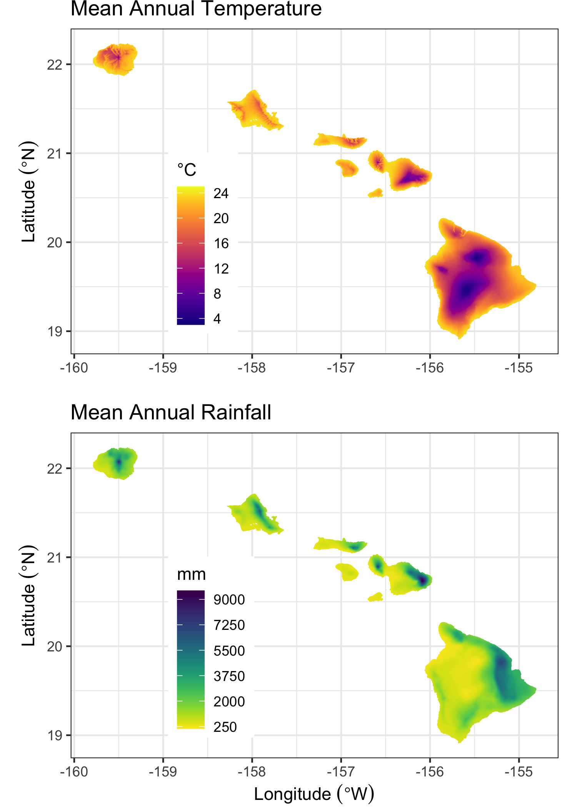
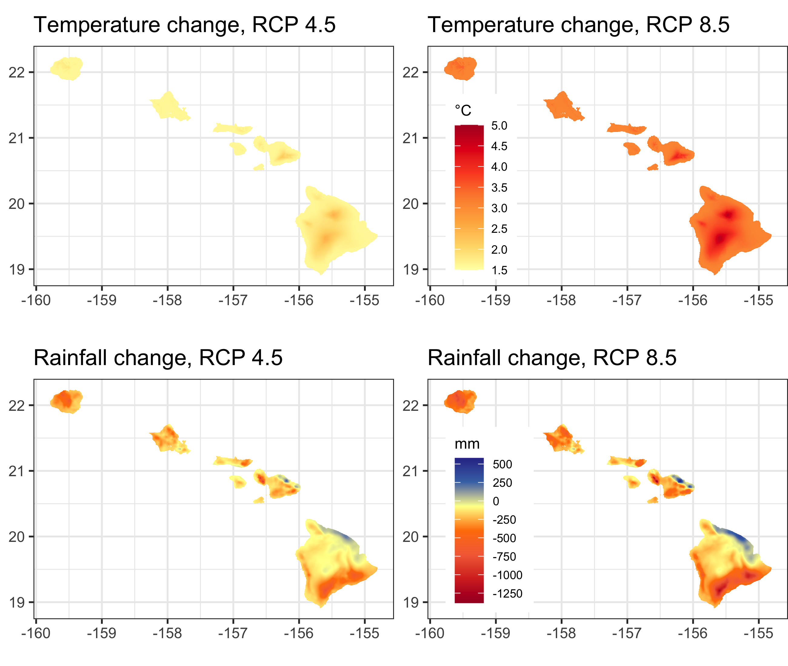
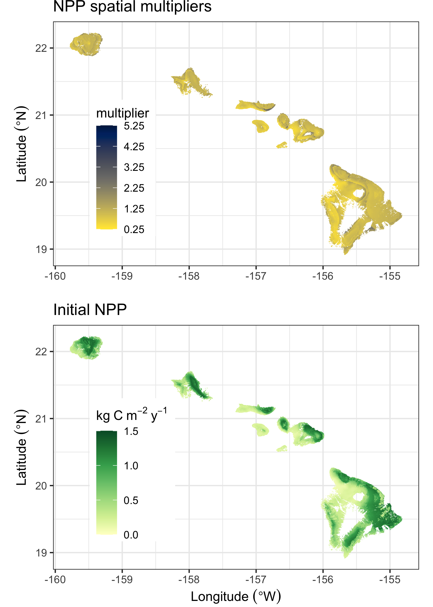
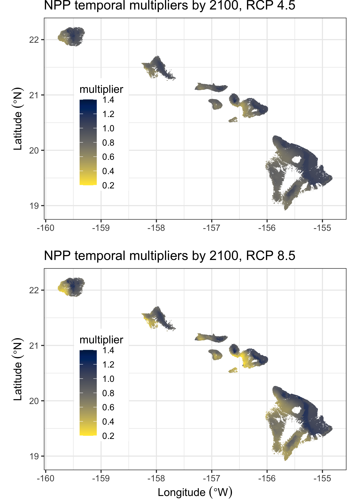

```{r setup, include=FALSE}
options(tinytex.verbose = TRUE)
knitr::opts_chunk$set(echo = FALSE)
```
# Supplementary Material 

\raggedright  
  
**Authors:** Paul C. Selmants^1^, Benjamin M. Sleeter^2^,  Jinxun Liu^1^, Tamara S. Wilson^1^,  
Clay Trauernicht^3^, Abby G. Frazier^4,5^, Gregory P. Asner^6^  
  
**Affiliations:**  
^1^U.S. Geological Survey, Moffett Field, CA, USA     
^2^U.S. Geological Survey, Seattle, WA, USA    
^3^University of Hawaiʻi at Mānoa, Honolulu, HI, USA  
^4^East-West Center, Honolulu, HI, USA     
^5^Clark University, Worcester, MA, USA   
^6^Arizona State University, Tempe, AZ, USA  

**Running title:** Hawaiʻi carbon balance  

**Keywords:** land use, climate change, carbon balance, Hawaiʻi, scenarios, disturbance, ecosystem model  

**Date:** `r format(Sys.time(), '%B %d, %Y')`


\pagebreak 

## Supplementary Methods
### *Moisture Zones*  
Agriculture, Forest, Grassland, Shrubland, and Tree Plantation land cover classes were stratified into three Moisture Zones - Dry, Mesic, and Wet (supplemental figure 1). These three zones were based on a moisture availability index (MAI), calculated as mean annual precipitation (MAP) minus potential evapotranspiration [PET; @price_mz_2012]. Areas where where MAI values were less than zero (i.e., MAP < PET) were classified in the Dry Moisture Zone. Areas with MAI values between zero and 1,661 were classified in the Mesic Moisture Zone. The MAI value of 1,661 is roughly equivalent to areas at 1,000 m elevation that receive 2,500 mm of annual rainfall [@price_mz_2012]. Areas with MAI values greater than 1,661 were classified in the Wet Moisture Zone.
```{r fig.align = 'center', out.width = "90%", fig.cap = "Supplemental - Moisture zones of the seven main Hawaiian Islands, reproduced from Jacobi \\textit{et al.} (2017). Credit: U.S. Geological Survey."}
knitr::include_graphics("./fig_images/figS1_MZ.png")
```
### *Wildland Fire*  
We used a new spatial database of wildland fire perimeters on the main Hawaiian Islands from 1999-2019 to calculate annual area burned (supplemental figure 2), wildland fire probabilities by state type, and wildland fire size distributions. This new database compiles prior mapping efforts and data collections with new fire perimeter data mapped by Dr. Clay Trauernicht (Department of Natural Resources and Environmental Management, University of Hawaiʻi at Mānoa). The goal was to locate and map all fires greater than or equal to 20 hectares, but some smaller fires were included as detected in imagery. Fire perimeters for the years 2002-2011 were primarily from the U.S. Geological Survey Monitoring Trends in Burn Severity (MTBS; https://www.mtbs.gov). The Hawaii Wildfire Management Organization (www.hawaiiwildfire.org) provided ground-based, GPS-mapped fire perimeters from Hawaiʻi Island, mostly from the Kona and Kohala regions. The U.S. National Park Service provided ground-based, GPS-mapped fire records from Hawaiʻi Volcanoes National Park, and the Oʻahu Army Natural Resource Program provided ground-based, GPS-mapped fire records on Oʻahu. All other fires were mapped directly by Dr. Trauernicht using LANDSAT and Sentinel-2 satellite imagery. Data from USGS MTBS were prioritized for the years 2002-2011 in the case of duplicate records.
```{r fig.align = 'center', out.width = "99%", fig.cap = "Supplemental - Annual area burned by wildland fire in the State of Hawaiʻi from 1999-2019, summed by year across the seven main Hawaiian Islands (A) and within each of the four largest islands (B). The dashed horizontal line in (A) represents the median area burned from 1999-2019."}
knitr::include_graphics("./fig_images/figS2_AnnualAreaBurned.png")
```
### *Climate*  
Spatially explicit contemporary mean annual temperature and rainfall data for the main Hawaiian Islands at 250-m resolution (supplemental figure 3) are from @giambelluca_online_2013 and @giambelluca_evapotranspiration_2014. Spatially explicit mid-century (2049-2069) and end of century (2070-2099) projections of change in annual temperature and annual rainfall (supplemental figure 4) are from statistically downscaled CMIP5 climate projections under RCP 4.5 and RCP 8.5 [@timm_statistical_2015; @timm_future_2017]. To avoid biases, the modeled present-day (1975–2005) CMIP5 climatology was used to standardize the resulting predictor time series, and the simulated future changes were measured relative to their present-day mean states. See @timm_statistical_2015 and @timm_future_2017 for a more detailed description of potential statistical downscaling biases.  
```{r fig.align = 'center', out.width = "80%", fig.cap = "Supplemental - Contemporary 30-year climate normals for mean annual temperature (top panel) and mean annual rainfall (bottom panel) for the seven main Hawaiian Islands. Data from Giambelluca \\textit{et al.} (2013) and Giambelluca \\textit{et al.} (2014)."}

```
```{r fig.align = 'center', out.width = "95%", fig.cap = "Supplemental - Projected change in mean annual temperature (top panels) and mean annual rainfall (bottom panels) by 2100 under RCP 4.5 and RCP 8.5 based on CMIP5 statistical downscaling. Data from Elison Timm \\textit{et al.} (2015) and Elison Timm (2017)."}

```
### *Scaling NPP*  
Initial values for net primary production (NPP) in LUCAS were calculated using values from the Integrated Biosphere Simulator (IBIS; supplemental table 1) adjusted with spatially explicit stationary NPP multipliers to reflect local variation driven by microclimate (supplemental Figure 5, top panel). The resulting NPP estimates (supplemental figure 5, bottom panel) preserve the IBIS-derived means for each combination of land cover class and moisture zone [supplemental table 1; @sleeter_effects_2018; @sleeter_effects_2019]. We derived the set of NPP stationary spatial multipliers by first calculating NPP independently of the IBIS values for each simulation cell using empirical relationships between annual NPP and mean annual rainfall or temperature [@schuur_productivity_2003; @del_grosso_global_2008] based on Hawaiʻi-specific contemporary climate data (supplemental Figure 3; @giambelluca_online_2013; @giambelluca_evapotranspiration_2014). We then calculated the NPP spatial multipliers as the NPP anomaly for each simulation cell relative to the mean of these empirically-derived NPP values for each unique combination of moisture zone and land cover class (supplemental Figure 5, top panel). LUCAS model NPP was initiated using the product of stationary spatial NPP multipliers (supplemental figure 5, top panel) and  IBIS-derived NPP (supplemental table 1).

Changes in NPP due to projected changes in climate were estimated using a set of temporal NPP multipliers representing the proportion of contemporary (2010) NPP (supplemental Figure 5) occuring in each simulation at mid-century and end-of-century under RCPs 4.5 and 8.5. We calculated temporal NPP multipliers by first estimating NPP for each simulation cell based on contemporary climate (supplemental figure 3) and projected future climates (supplemental figure 4) using empirical relationships between NPP and climate [@schuur_productivity_2003; @del_grosso_global_2008]. We then divided contemporary NPP estimates by future NPP estimates in each simulation cell to derive mid-century and end-of-century temporal multipliers (supplemental figure 6). Annual increments were calculated by dividing mid-century and end-of-century temporal multipliers by the number of intervening years.  
```{r}
library(kableExtra)
ibisnpp <- read.csv("IBISnpp_wide.csv", stringsAsFactors = FALSE)
kbl(ibisnpp, booktabs = T, caption = "Supplemental - Mean IBIS-derived NPP values by Land Cover and Moisture Zone, in kg of C per square meter per year.") %>%
   add_header_above(c(" ", "NPP by Moisture Zone" = 3))
```
```{r fig.align = 'center', out.width = "80%", fig.cap = "Supplemental - Stationary spatial NPP multipliers (top panel) and initial NPP based on the product of mean IBIS-derived NPP values (supplemental Table 1) and stationary spatial NPP multipliers (above). Developed and Barren land cover types are excluded from both maps."}

```
```{r fig.align = 'center', out.width = "80%", fig.cap = "Supplemental - Temporal NPP multipliers for the year 2100 under RCP 4.5 (top panel) and RCP 8.5 (bottom panel). Temporal NPP multipliers represent the relative amount of initial (2010) NPP that occurs in each pixel in the year 2100 under each of two representative concentration pathways (RCPs) for atmospheric carbon dioxide. Developed and Barren land cover types are excluded from both maps."}

```
### *Land Cover Change*
Projections of land area covered by each of five land cover classes (Agriculture, Developed, Forest, Grassland and Shrubland) summed by year and Monte Carlo iteration across the seven main Hawaiian Islands for each of two land use scenarios (low and high) are displayed in supplemental Figure 7. The decline in agricultural land between 2020 and 2040 in the low land use scenario led directly to the increase in Forest, Grassland, and Shrubland land area over the same time period. Changes in agricultural land area over time in the high land use scenario reflect a balance between high rates of agricultural contraction and high rates of agricultural expansion.   


```{r fig.align = 'center', out.width = "99%", fig.cap = "Supplemental - Projections of total land area by year for Agriculture, Developed, Forest, Grassland and Shrubland land cover classes in the Hawaiian Islands under low and high land use change scenarios for the period 2010-2100. Solid lines represent the mean of 30 Monte Carlo realizations and shaded areas represent minimum and maximum Monte Carlo values."}

```
## References