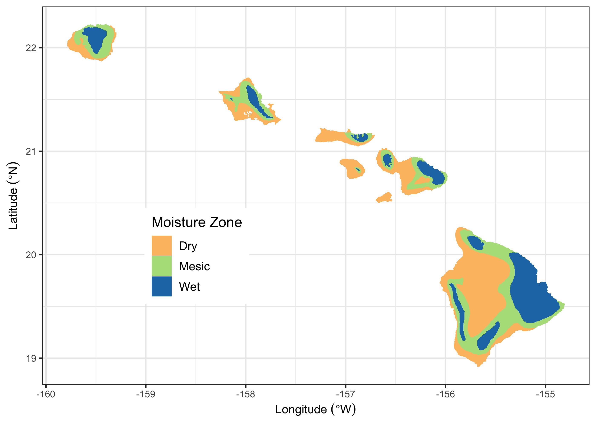

```{r setup, include=FALSE}
options(tinytex.verbose = TRUE)
knitr::opts_chunk$set(echo = FALSE)
```
\raggedright
## Supplementary Material: Ecosystem carbon balance in the Hawaiian Islands under different scenarios of future climate and land use change
`r format(Sys.time(), '%B %d, %Y')`  

### Moisture Zones

State Classes for Agriculture, Forest, Grassland, Shrubland, and Tree Plantations were stratified into three Moisture Zones - Dry, Mesic, and Wet (Figure S1). These three zones were based on a moisture availability index (MAI), calculated as mean annual precipitation (MAP) minus potential evapotranspiration [PET; @price_mz_2012]. Areas where where MAI values were less than zero (i.e., where MAP < PET) were classified in the Dry Moisture Zone. Areas with MAI values between zero and 1,661 were classified in the Mesic Moisture Zone. The MAI value of 1,661 is roughly equivalent to areas at 1,000 m elevation that receive 2,500 mm of annual rainfall [@price_mz_2012]. Areas with MAI values greater than 1,661 were classified in the Wet Moisture Zone.

```{r fig.align = 'center', out.width = "95%", fig.cap = "Supplemental - Moisture zones of the seven main Hawaiian Islands, adapted from Jacobi \\textit{et al.} (2017)."}

```

### Wildland Fire

This study used a new spatial database of wildland fire perimeters on the main Hawaiian Islands from 1999-2019 to calculate annual area burned (Figure S2), wildland fire probabilities by Moisture Zone and State Class, and wildland fire size distributions. This new database compiles prior mapping efforts and data collections with new fire perimeter data mapped directly by Dr. Clay Trauernicht (Department of Natural Resources and Environmental Management, University of Hawaiʻi at Mānoa). The goal of this effort was to locate and map all fires greater than or equal to 20 hectares, but some smaller fires were included as detected in imagery. Fire perimeters for the years 2002-2011 were primarily from the U.S. Geological Survey's Monitoring Trends in Burn Severity (MTBS; https://www.mtbs.gov). The Hawaii Wildfire Management Organization (www.hawaiiwildfire.org) provided ground-based, GPS-mapped fire perimeters from Hawaiʻi Island, primarily in the Kona and Kohala regions. The U.S. National Park Service provided ground-based, GPS-mapped fire records from Hawaiʻi Volcanoes National Park. The Oʻahu Army Natural Resource Program provided ground-based, GPS-mapped fire records on Oʻahu. All other fires were mapped directly by Dr. Trauernicht using LANDSAT and Sentinel-2 satellite imagery. Data from USGS MTBS were prioritized for the years 2002-2011 in the case of duplicate records.

```{r fig.align = 'center', out.width = "99%", fig.cap = "Supplemental - Annual area burned by wildland fire in the State of Hawaiʻi from 1999-2019, summed by year across the seven main Hawaiian Islands (A) and within each of the four largest islands (B). The dashed horizontal line in (A) represents the median area burned from 1999-2019."}
knitr::include_graphics("./fig_images/figS2_AnnualAreaBurned.png")
```

### Climate

Spatially explicit contemporary mean annual temperature and rainfall data for the main Hawaiian Islands at 250-m resolution (Figure S3) are from @giambelluca_online_2013 and @giambelluca_evapotranspiration_2014. Spatially explicit projections of change in annual temperature and change in annual rainfall by the end of century (2100; Figure S4) were developed using statistically downscaled CMIP5 climate projections for the Hawaiian Islands from @timm_statistical_2015 and @timm_future_2017 under RCP 4.5 and RCP 8.5. 

```{r fig.align = 'center', out.width = "95%", fig.cap = "Supplemental - Mean annual temperature (top panel) and mean annual rainfall (bottom panel) for the seven main Hawaiian Islands. Data from Giambelluca \\textit{et al.} (2013) and Giambelluca \\textit{et al.} (2014)."}
knitr::include_graphics("./fig_images/figS3_CurrentClimate.png")
```
```{r fig.align = 'center', out.width = "99%", fig.cap = "Supplemental - Projected change in mean annual temperature (top panels) and mean annual rainfall (bottom panels) by 2100 under RCP 4.5 and RCP 8.5 based on statistical downscaling of an ensemble of climate models (CMIP5)."}
knitr::include_graphics("./fig_images/figS4_FutureClimate.png")
```

### Change in State Class Area

Projections of total land area covered by each of five State Classes (Agriculture, Developed, Forest, Grassland and Shrubland) were summed by year and Monte Carlo iteration across the seven main Hawaiian Islands for each of two land use scenarios (low and high; Figure S5).

```{r fig.align = 'center', out.width = "99%", fig.cap = "Supplemental - Projections of total land area by year for each of five State Classes in the seven main Hawaiian Islands (Agriculture, Developed, Forest, Grassland, and Shrubland) under low and high land use change scenarios for the period 2010-2100. Solid lines represent the mean of 30 Monte Carlo realizations and shaded areas represent minimum and maximum Monte Carlo values."}

```

\pagebreak

## References