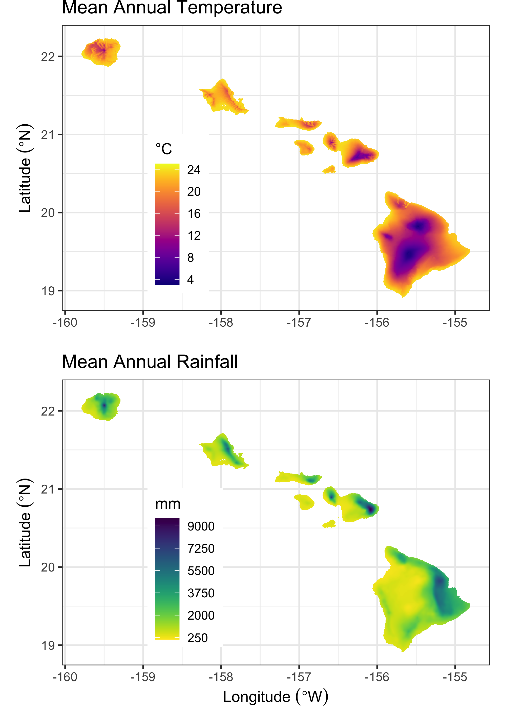

```{r setup, include=FALSE}
options(tinytex.verbose = TRUE)
knitr::opts_chunk$set(echo = FALSE)
```
\centering
Paul C. Selmants^1,6^, Benjamin M. Sleeter^2^,  Jinxun Liu^1^, Tamara S. Wilson^1^,  
Parker C. Trauernicht^3^, Abby G. Frazier^4^, Gregory P. Asner^5^  

\raggedright
**Affiliations:**  
^1^U.S. Geological Survey, Moffett Field, CA, USA   
^2^U.S. Geological Survey, Seattle, WA, USA  
^3^University of Hawaiʻi at Mānoa, Honolulu, HI, USA  
^4^The East-West Center, Honolulu, HI, USA  
^5^Arizona State University, Tempe, AZ, USA  
^6^Author to whom correspondence should be addressed  
  

**Email:** pselmants@usgs.gov  

**Running title:** Hawaii carbon balance  
**Keywords:** land use, climate change, carbon balance, Hawaii, scenarios, disturbance, ecosystem model  
  
  
**Date:** `r format(Sys.time(), '%B %d, %Y')`  
   

\pagebreak

## Moisture Zones

State Classes for Agriculture, Forest, Grassland, Shrubland, and Tree Plantations were stratified into three Moisture Zones - Dry, Mesic, and Wet (Figure S1). These three zones were based on a moisture availability index (MAI), calculated as mean annual precipitation (MAP) minus potential evapotranspiration [PET; @price_mz_2012]. Areas where the MAI was less than zero, i.e. where PET exceeded MAP, were classified in the Dry Moisture Zone. Areas with MAI values between zero and 1,661 were classified in the Mesic Moisture Zone. The MAI value of 1,661 is roughly equivalent to areas at 1,000m elevation that receive 2,500 mm of annual rainfall [@price_mz_2012]. Areas with MAI values that exceeded 1,661 were classified in the Wet Mesic Zone.

```{r fig.align = 'center', out.width = "99%", fig.cap = "Moisture zones of the seven main Hawaiian Islands, adapted from Jacobi \\textit{et al.} (2017)."}
knitr::include_graphics("./fig_images/figS1_MZ.png")
```
## Wildland Fire

This study used a new spatial database of wildland fire perimeters in the Hawaiian Islands for the years 1999-2019 using data compiled from the Monitoring Trends in Burn Severity (MTBS) program, the Hawaiʻi Wildfire Management Organization, the U.S. National Park Service, the Oʻahu Army Natural Resources Program, and independent remote sensing analyses using publicly available LandSat data. This new wildland fire spatial database was used to calculate annual area burned (Figure S2), wildland fire probabilities by Moisture Zone and State Class, and wildland fire size distributions. 

```{r fig.align = 'center', out.width = "99%", fig.cap = "Annual area burned by wildland fire in the State of Hawaiʻi from 1999-2019, summed by year across the seven main Hawaiian Islands (A) and within each of the four largest islands (B). The dashed horizontal line in (A) represents the median area burned from 1999-2019."}
knitr::include_graphics("./fig_images/figS2_AnnualAreaBurned.png")
```
## Climate

Spatially explicit contemporary mean annual temperature and rainfall data for the main Hawaiian Islands at 250-m resolution (Figure S3) are from @giambelluca_online_2013 and @giambelluca_evapotranspiration_2014. Spatially explicit projections of changes in annual temperature and rainfall by the year 2100 were developed using statistically downscaled CMIP5 climate projections for the Hawaiian Islands from @timm_statistical_2015 and @timm_future_2017 under RCPs 4.5 and 8.5 (Figure S5). 

```{r fig.align = 'center', out.width = "95%", fig.cap = "Mean annual temperature (top panel) and mean annual rainfall (bottom panel) for the seven main Hawaiian Islands. Data from Giambelluca \\textit{et al.} (2013) and Giambelluca \\textit{et al.} (2014)."}

```
```{r fig.align = 'center', out.width = "99%", fig.cap = "Projected change in mean annual temperature (top panels) and mean annual rainfall (bottom panels) by end of century under RCPs 4.5 and 8.5 (top panels) based on statistical downscaling of an ensemble of climate models (CMIP5)."}
knitr::include_graphics("./fig_images/figS4_FutureClimate.png")
```
## Change in State Class Area

Projections of total land area covered by each State Class were summed by year and Monte Carlo iteration across the seven main Hawaiian Islands from LUCAS model output data.

```{r fig.align = 'center', out.width = "99%", fig.cap = "Projections of total land area by year for each of five State Classes in the seven main Hawaiian Islands (Agriculture, Developed, Forest, Grassland, and Shrubland) under low and high land use change scenarios for the period 2010-2100. Solid lines represent the mean of 30 Monte Carlo realizations and shaded areas represent minimum and maximum Monte Carlo values."}
knitr::include_graphics("./fig_images/figS5_StateClassArea.png")
```
## References